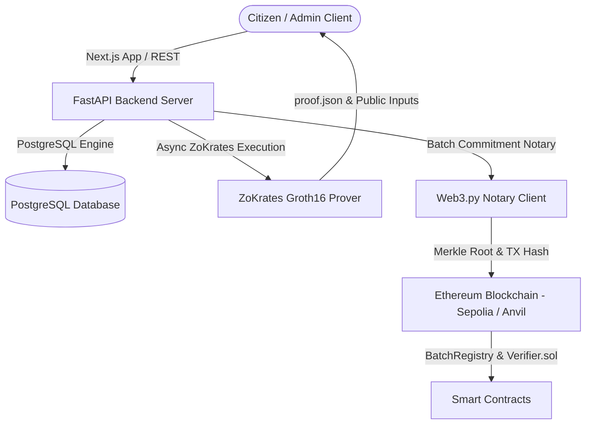

# AADL_ON — Algorithmic Housing Allocation Notary & ZK Audit Portal

> **Algorithmic Housing Allocation Notary & Zero-Knowledge Priority Verification Platform for National Programs.**

---

## 🏛️ Executive Summary

**AADL_ON** is a production-grade Web3 & Zero-Knowledge (ZK) Housing Allocation Notary platform designed to eliminate allocation corruption, guarantee 100% queue integrity, and protect citizen privacy.

By combining **Off-Chain Batch Merkle Notarization** on Ethereum with **Groth16 Zero-Knowledge Priority Proofs (ZoKrates)**, AADL_ON ensures:
1. **Public Auditability**: Citizens can independently audit their position and notarized commitment on the Ethereum blockchain.
2. **Zero-Knowledge Privacy**: Citizens can mathematically prove their priority score calculation is accurate without exposing private personal criteria (income, marital status, children count, disability).
3. **98%+ Gas Optimization**: Batch commitments reduce on-chain storage costs by anchoring hundreds of queue slots in a single 32-byte Merkle Root.

---

## 🏗️ System Architecture



---

## ⚡ Core Features & Technical Innovations

- 🛡️ **Zero-Knowledge Priority Verification**: Built using ZoKrates Groth16 ZK-SNARK circuit (`priority_validator.zok`) proving `calculated_score == f(age, married, children, income, disabled)` without revealing inputs.
- 🌳 **Merkle Tree Batch Notarization**: Aggregates applicant hashes into deterministic Merkle roots and anchors them on-chain via `BatchRegistry.sol`.
- 🔐 **Role-Based Security & Rate Limiting**: Managed with OpenZeppelin `AccessControl` and custom sliding-window thread-safe rate limiters.
- 🌐 **Executive Document Minimalist & Dual-Language UI**: High-contrast, accessibility-first design supporting both English LTR (`dir="ltr"`) and Arabic RTL (`dir="rtl"`).
- 🧪 **Comprehensive Foundry Test Suite**: 100% smart contract code coverage for access control, state transitions, custom errors, and ZK verifier integration.

---

## 🚀 Quick Start (Local Setup)

### Prerequisites
- **Foundry** (`forge`, `anvil`): [https://getfoundry.sh](https://getfoundry.sh)
- **Python 3.10+** & **Docker Compose**
- **Node.js 18+** & **npm**

### 1. Smart Contracts (Foundry)
```bash
# Build smart contracts
forge build

# Run comprehensive test suite
forge test -vvv

# Local Anvil deployment
anvil &
forge script script/DeployBatchRegistry.s.sol --rpc-url http://127.0.0.1:8545 --broadcast
```

### 2. Backend (FastAPI + ZoKrates)
```bash
# Set up Python virtual environment & dependencies
python3 -m venv .venv
source .venv/bin/activate
pip install -r requirements.txt

# Start database & backend
uvicorn backend.main:app --reload --port 8000
```

### 3. Frontend (Next.js 14)
```bash
cd frontend
npm install
npm run dev
# Access portal at http://localhost:3000
```

---

## 🔬 ZK-SNARK Circuit Specification (`priority_validator.zok`)

```rust
def main(
    private u32 age,
    private bool is_married,
    private u32 number_of_children,
    private u32 monthly_income,
    private bool is_disabled,
    public u32 public_score
) {
    u32 score = 0;
    score = score + (age >= 30 && age <= 45 ? 20 : 0);
    score = score + (is_married ? 15 : 0);
    score = score + number_of_children * 10;
    score = score + (monthly_income < 50000 ? 30 : 0);
    score = score + (is_disabled ? 40 : 0);

    assert(score == public_score);
    return;
}
```

---

## ⚖️ License

Distributed under the **MIT License**. See `LICENSE` for details.
