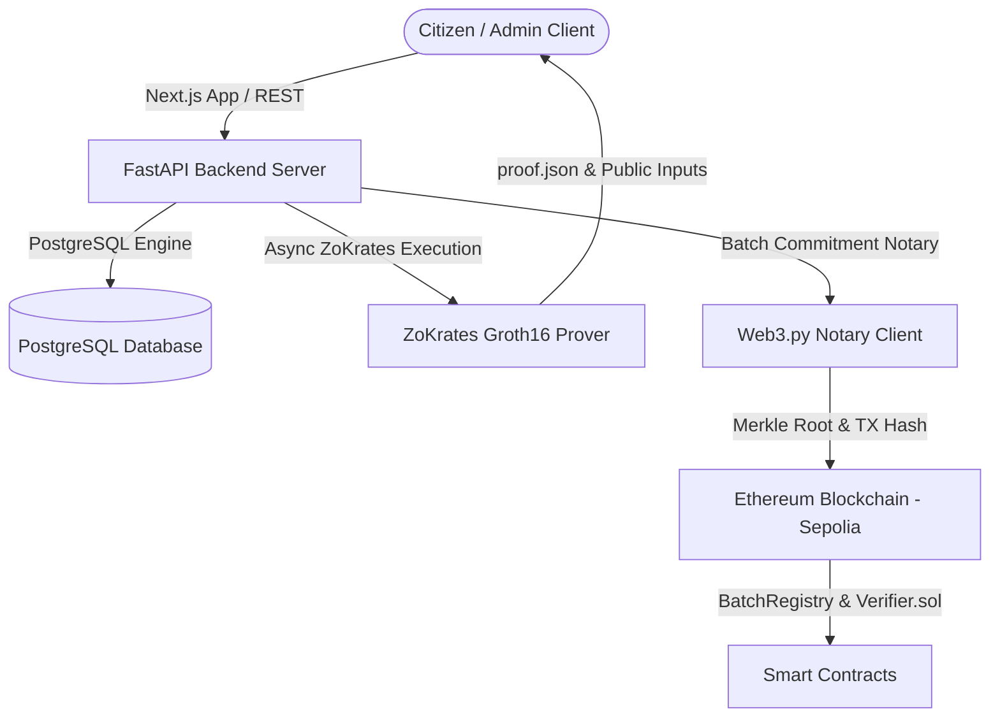

# AADL_ON: Algorithmic Housing Allocation Notary & ZK Audit Portal

> Algorithmic housing allocation notary and zero-knowledge priority verification platform for national programs.

---

## Executive Overview & Problem Statement

In public sector allocation programs, transparency, auditability, and privacy are the most critical requirements alongside operability . The current AADL housing program faces challenges with data opacity: citizens cannot independently audit their queue position, and sensitive personal financial data remains exposed to database operators. 

AADL_ON addresses these challenges by combining Distributed Ledger Technology (DLT) with Zero-Knowledge Proofs (ZK-SNARKs). Ethereum Merkle notarization provides public queue transparency and immutable tracking, while Zero-Knowledge proofs preserve applicant privacy. Combined, they establish an end-to-end, audit-verifiable pipeline from initial application scoring through on-chain batch commitment

---

## System Architecture


```mermaid
graph TD
    User([Citizen / Admin Client]) -->|Next.js App / REST| API[FastAPI Backend Server]
    API -->|PostgreSQL Engine| DB[(PostgreSQL Database)]
    API -->|Async ZoKrates Execution| ZK[ZoKrates Groth16 Prover]
    ZK -->|proof.json & Public Inputs| User
    API -->|Batch Commitment Notary| Web3[Web3.py Notary Client]
    Web3 -->|Merkle Root & TX Hash| Chain[Ethereum Blockchain - Sepolia]
    Chain -->|BatchRegistry & Verifier.sol| Contracts[Smart Contracts]
```

## Features

- **Zero-Knowledge Priority Verification**: ZoKrates Groth16 ZK-SNARK circuit (`priority_validator.zok`) proving priority score calculation without revealing raw applicant data.
- **Merkle Tree Batch Notarization**: Hashes applicant records into Merkle trees and commits roots on-chain in `BatchRegistry.sol`.
- **Role-Based Access Control**: OpenZeppelin `AccessControl` managing contract operator permissions.
- **Dual-Language UI**: Next.js frontend supporting English and Arabic.

## Quick Start

### Prerequisites
- **Docker Compose** & **Docker**
- **Foundry** (`forge`): https://getfoundry.sh

### 1. Run Microservices

```bash
cp .env.example .env
docker compose up --build
```

- **Frontend Citizen Portal:** `http://localhost:3000`
- **FastAPI OpenAPI Docs:** `http://localhost:8000/docs`

### 2. Smart Contract Testing

```bash
forge build
forge test -vvv
```

### 3. Integration Testing

```bash
# Execute database-agnostic integration test suite
python3 test_integration.py
```

---

## Circuit Specification (`priority_validator.zok`)

```rust
def main(
    private u32 age,
    private bool is_married,
    private u32 number_of_children,
    private u32 monthly_income,
    private bool is_disabled,
    public u32 public_score
) {
    u32 age_points = if age >= 30 && age <= 45 { 20 } else { 0 };
    u32 married_points = if is_married { 15 } else { 0 };
    u32 children_points = number_of_children * 10;
    u32 income_points = if monthly_income < 50000 { 30 } else { 0 };
    u32 disabled_points = if is_disabled { 40 } else { 0 };

    u32 computed_score = age_points + married_points + children_points + income_points + disabled_points;

    assert(computed_score == public_score);
    return;
}
```

---

## License

Distributed under the MIT License. See `LICENSE` for details.
