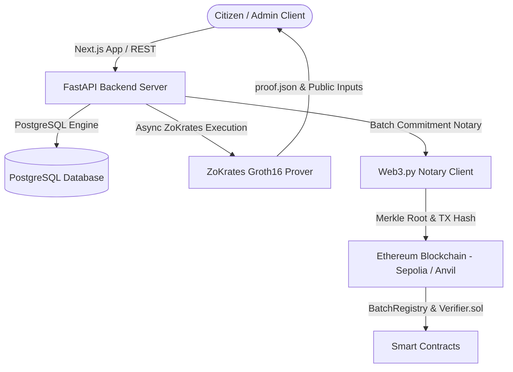

# AADL_ON: Algorithmic Housing Allocation Notary & ZK Audit Portal

> Algorithmic housing allocation notary and zero-knowledge priority verification platform for national programs.

---

## Executive Overview & Problem Statement

In public sector allocation programs, transparency, auditability, and privacy are the most critical requirements alongside operability. The current AADL housing program faces challenges with data opacity: citizens cannot independently audit their application status, and sensitive personal financial data remains exposed to database operators. 

AADL_ON addresses these challenges by combining Distributed Ledger Technology (DLT) with Zero-Knowledge Proofs (ZK-SNARKs). Ethereum Merkle notarization provides public queue transparency and immutable tracking, while Zero-Knowledge proofs preserve applicant privacy. Combined, they establish an end-to-end, tamper-proof audit pipeline from the moment an application is marked eligible until its allocation turn comes.

---

## System Architecture


```mermaid
graph TD
    User([Citizen / Admin Client]) -->|Next.js App / REST| API[FastAPI Backend Server]
    API -->|PostgreSQL Engine| DB[(PostgreSQL Database)]
    API -->|Async ZoKrates Execution| ZK[ZoKrates Groth16 Prover]
    ZK -->|proof.json & Public Inputs| User
    API -->|Batch Commitment Notary| Web3[Web3.py Notary Client]
    Web3 -->|Merkle Root & TX Hash| Chain[Ethereum Blockchain - Sepolia / Anvil]
    Chain -->|BatchRegistry & Verifier.sol| Contracts[Smart Contracts]
```

---

## Key Technical Features

- **Zero-Knowledge Priority Verification**: Uses ZoKrates Groth16 ZK-SNARK circuit (`priority_validator.zok`) proving `calculated_score == f(age, married, children, income, disabled)` without exposing private input criteria.
- **Merkle Tree Batch Notarization**: Hashes applicant records into deterministic Merkle roots and anchors commitments on-chain via `BatchRegistry.sol`.
- **Role-Based Access Control & Rate Limiting**: OpenZeppelin `AccessControl` for smart contract permissioning and sliding-window rate limiters for API endpoints.
- **Executive Document UI & Dual-Language Support**: Accessible interface supporting both English (LTR) and Arabic (RTL) layouts.
- **Foundry Test Suite**: Smart contract unit tests covering access control, state transitions, custom error reverts, and ZK verifier routing.

---

## Quick Start

### Prerequisites
- **Docker Compose** & **Docker**
- **Foundry** (`forge`, `anvil`): https://getfoundry.sh

### 1. Run Microservices (Docker Compose)

```bash
# 1. Copy environment configuration
cp .env.example .env

# 2. Start services (PostgreSQL, Anvil, Backend, Indexer, Frontend)
docker compose up --build
```

- **Frontend Portal:** `http://localhost:3000`
- **API Documentation:** `http://localhost:8000/docs`

### 2. Smart Contract Testing (Foundry)

```bash
# Build contracts and run unit test suite
forge build
forge test -vvv
```

### 3. Integration Verification Test

```bash
# Execute end-to-end integration test
python3 test_integration.py
```

---

## Circuit Specification (`priority_validator.zok`)

```rust
def main(
    private u32 age,
    private bool is_married,
    private u32 number_of_children,
    private u32 monthly_income,
    private bool is_disabled,
    public u32 public_score
) {
    u32 score = 0;
    score = score + (age >= 30 && age <= 45 ? 20 : 0);
    score = score + (is_married ? 15 : 0);
    score = score + number_of_children * 10;
    score = score + (monthly_income < 50000 ? 30 : 0);
    score = score + (is_disabled ? 40 : 0);

    assert(score == public_score);
    return;
}
```

---

## License

Distributed under the MIT License. See `LICENSE` for details.
